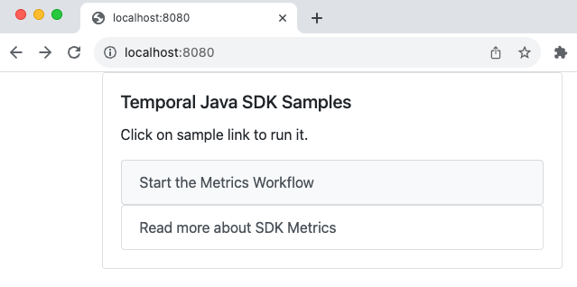
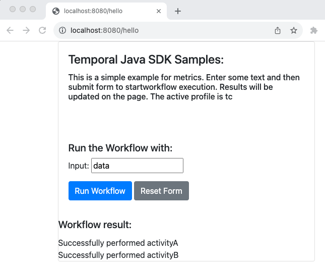
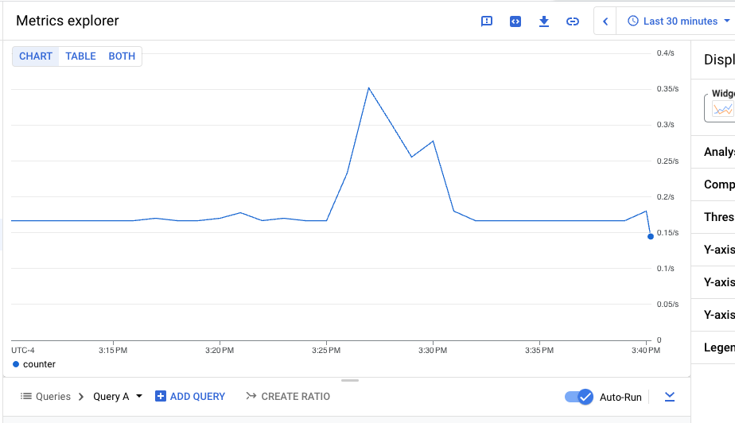

# Temporal on Cloud Run

This repository demonstrates how to run workers on [GCP's Cloud Run](https://cloud.google.com/run). 
Cloud Run is a serverless offering making it easier to deploy and run containerized applications. 
Initially Cloud Run was only for web based applications that responds to requests. Over time Cloud Run
has added the ability to run jobs as well. 

As awesome as Cloud Run is, there are some challenges that need to be addressed for applications that 
act as Temporal workers. One challenge is that Cloud Run is designed to run when requests are made, 
which provides a nice pay per use model. Unfortunately this doesn't play well with workers which long 
poll Temporal, waiting for work to process. 

The workaround for this is to disable [CPU Throttling](https://cloud.google.com/run/docs/configuring/cpu-allocation#setting). In YAML this looks like this:

```yaml
spec:
  template:
    metadata:
      annotations:
        run.googleapis.com/cpu-throttling: 'false'  # we need to keep the CPU running
```

Another challenge is that by default, an application running Cloud Run is scaled down to zero instances 
if there are no inbound web requests. This too, doesn't play well with Temporal workers.

The workaround for this is to set the [minimum number of instances](https://cloud.google.com/run/docs/configuring/min-instances#setting):

```yaml
spec:
  template:
    metadata:
      annotations:
        autoscaling.knative.dev/minScale: '1' # keep one instance available
```

Cloud Run only allows one port to be publicly exposed and exposing a Temporal SDK Metrics 
endpoint externally is not a good idea. Deploy the [Open Telemetry Connector](https://cloud.google.com/run/docs/tutorials/custom-metrics-opentelemetry-sidecar) in a 
[sidecar container](https://cloud.google.com/blog/products/serverless/cloud-run-now-supports-multi-container-deployments). 
The Open Telemetry Collector reads the Temporal SDK Metrics Prometheus scrape endpoint and can push 
the metrics (and optionally tracing and logging) to a destination of your choice. 

In this example, I chose to send the metrics to [Google Cloud Managed Prometheus](https://cloud.google.com/managed-prometheus).
The collector supports a wide range of other [exporters](https://opentelemetry.io/ecosystem/registry/?component=exporter) 
including Prometheus Remote Write Collector, Datadog, Splunk, Google Cloud Pubsub, Google Cloud Operations Collector. 
The full list of exporters are available [here](https://opentelemetry.io/ecosystem/registry/?component=exporter).

## Project Organization

The structure of this repository is laid out in the following manner

* [app](app/readme.md) - Sample Java application to deploy to Cloud Run
* [collector](collector) - Contains details for running the Open Telemetry Connector
* [gcp-infra](gcp-infra/readme.md) - [Pulumi](https://www.pulumi.com/) project to create a new GCP project

## How to Use this example

* Follow the steps listed in the [gcp-infra/readme](gcp-infra/readme.md). 
* Once the application has been deployed, you can access the application.

### Access via private

By default, the application is not publicly visible. To access use the following command:

```shell
gcloud beta run services proxy temporal-metrics-sample --project <PROJECT_ID> --region <REGION>
```
Once the proxy is running, visit the application by navigating to [http://localhost:8080]

### Make the Application Public

To access the application via its public URL, uncomment the last step in [cloudbuild.yaml](cloudbuild.yaml). 
Alternatively, you can run the following command:

````shell
gcloud run services set-iam-policy temporal-metrics-sample policy.yaml --region <REGION>
````

To retrieve the public URL run the following command:

````shell
gcloud run services describe temporal-metrics-sample --region <REGION> --format='value(status.url)'
````

### Start the Workflow

Using the appropriate URL, (see the section above), navigate to application. You should see the following page:



Click on the Start the Metrics Worfklow


Enter some text for the input and click the Run Workflow button. This will start the workflow. After about 30 seconds, the workflow will complete:



The application purposefully fails the activity for a few times before completing so that there are interesting metrics.

Start the workflow a couple of more times to get a few more executions. 

Open up the Temporal Cloud console, by navigating to [https://cloud.temporal.io](https://cloud.temporal.io) to view the progress of the workflows.

### View Metrics in Google Cloud Monitoring

Open the [Metrics Explorer](https://console.cloud.google.com/monitoring/metrics-explorer) in Google Cloud Console. In 
the Metric drop down, scroll down to Prometheus Target, Temporal and click on Prometheus/temporal_long_request_total/counter 
and click on the Apply button.


Now in the time box near the upper right of the screen, click the down arrow and select Last 30 Minutes. You should see 
a graph that looks similar to this one:



Feel free to experiment adding additional metrics.


